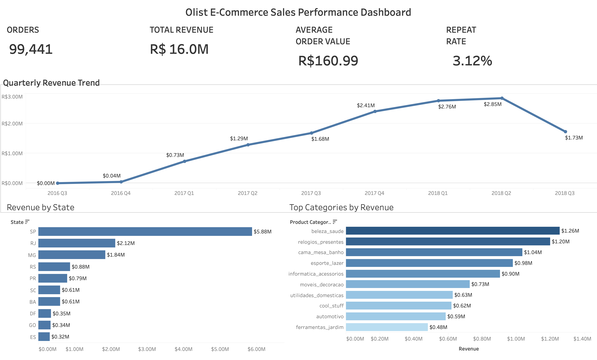

# Olist E-Commerce Sales & Customer Analytics

A SQL and Tableau project analyzing 99,000+ e-commerce orders from the Brazilian Olist marketplace to uncover insights into sales performance, customer behavior, product demand, and operational efficiency.

## Dashboard 1: Sales Performance Overview

## Dashboard 2: Product & Customer Insights

---

## Project Overview

This project analyzes the Brazilian Olist E-Commerce dataset using SQL and Tableau to uncover insights into sales performance, customer behavior, product trends, and operational efficiency.

The project combines SQL for data extraction and KPI generation with Tableau for interactive dashboard creation.

---

## Dataset Source

https://www.kaggle.com/datasets/olistbr/brazilian-ecommerce

---

## Tools & Technologies

- MySQL
- SQL
- Tableau
- GitHub

---

## Business Questions Answered

### Sales Performance

- What is the total revenue generated?
- How many orders were placed?
- What is the average order value?
- What is the repeat customer rate?
- How has revenue changed over time?
- Which states generate the highest revenue?
- Which product categories contribute the most revenue?

### Customer & Operations

- What is the average customer review score?
- What percentage of orders are delivered on time?
- What is the average shipping duration?
- How many active sellers operate on the platform?
- Which categories dominate different states?
- Which categories sell the most units?
- Which categories receive the highest customer ratings?

---

## Key KPIs

| KPI | Value |
|------|------|
| Total Revenue | R$16.0M |
| Total Orders | 99,441 |
| Average Order Value | R$160.99 |
| Repeat Customer Rate | 3.12% |
| Average Review Score | 4.09 |
| On-Time Delivery Rate | 91.89% |
| Average Shipping Days | 12.5 |
| Seller Count | 289 |

---

## Key Insights

### Revenue & Sales

- Total revenue exceeded R$16 million.
- Revenue grew significantly throughout 2017 and peaked during 2018.
- São Paulo generated the highest revenue among all states.
- A small number of product categories contributed the majority of revenue.

### Customer Experience

- Average customer review score remained above 4.0.
- More than 91% of orders were delivered on time.
- Average shipping duration was approximately 12.5 days.

### Product Performance

- **cama_mesa_banho** generated the highest unit sales.
- **beleza_saude** consistently ranked among the highest revenue-generating categories.
- Highly rated categories maintained average review scores above 4.0 based on substantial review volume.

### Strategic Recommendations

1. Increase focus on high-performing states such as São Paulo.
2. Expand inventory for top-selling categories.
3. Maintain strong delivery performance standards.
4. Leverage highly rated categories to improve customer trust.
5. Use regional category trends for targeted marketing campaigns.

---

## Files Included

| File | Description |
|--------|-------------|
| Ecommerce.sql | SQL queries used for KPI and analysis generation |
| DASHBOARD1.twb | Tableau Sales Performance Dashboard |
| DASHBOARD2.twb | Tableau Customer & Product Insights Dashboard |
| dashboard_1.png | Dashboard 1 Screenshot |
| dashboard_2.png | Dashboard 2 Screenshot |
| business_insights.md | Summary of business findings |

---

## Author

**Jigyasa Rai**  
B.Tech Computer Science Student | SQL | Tableau | Data Analytics
